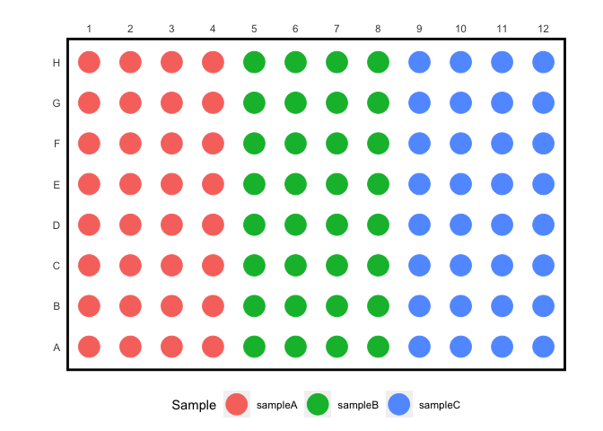

simplePlates
================

A set of simple functions for working with plate-based data.

> “omg this is the best thing ever i love simplePlates” - Somayra, 2020

### Installation

``` r
devtools::install_github("bradyajohnston/simpleplates")
```

## Example use cases.

### `make_plate()`

For quickly generating sample and concentration data for a plate, to
later match with observed data. The rows can be either letters or a
numeric verctor (*numbers must be &gt; 0 and &lt; 26*).

``` r
make_plate(
  rows = LETTERS[1:3], 
  cols = 1:3, 
  sample = "foo"
)
```

    ##   wells cols rows sample
    ## 1    A1    1    A    foo
    ## 2    A2    2    A    foo
    ## 3    A3    3    A    foo
    ## 4    B1    1    B    foo
    ## 5    B2    2    B    foo
    ## 6    B3    3    B    foo
    ## 7    C1    1    C    foo
    ## 8    C2    2    C    foo
    ## 9    C3    3    C    foo

``` r
make_plate(
  rows = 1:3, 
  cols = 1:3, 
  sample = "foo"
)
```

    ##   wells cols rows sample
    ## 1    A1    1    A    foo
    ## 2    A2    2    A    foo
    ## 3    A3    3    A    foo
    ## 4    B1    1    B    foo
    ## 5    B2    2    B    foo
    ## 6    B3    3    B    foo
    ## 7    C1    1    C    foo
    ## 8    C2    2    C    foo
    ## 9    C3    3    C    foo

``` r
make_plate(
  rows = 1:3, 
  cols = 1:3, 
  sample = c("sampleA", "sampleB", "sampleC")
)
```

    ##   wells cols rows  sample
    ## 1    A1    1    A sampleA
    ## 2    A2    2    A sampleB
    ## 3    A3    3    A sampleC
    ## 4    B1    1    B sampleA
    ## 5    B2    2    B sampleB
    ## 6    B3    3    B sampleC
    ## 7    C1    1    C sampleA
    ## 8    C2    2    C sampleB
    ## 9    C3    3    C sampleC

``` r
make_plate(
  rows = 1:3, 
  cols = 1:3, 
  sample = rep(c("sampleA", "sampleB", "sampleC"), each = 3)
)
```

    ##   wells cols rows  sample
    ## 1    A1    1    A sampleA
    ## 2    A2    2    A sampleA
    ## 3    A3    3    A sampleA
    ## 4    B1    1    B sampleB
    ## 5    B2    2    B sampleB
    ## 6    B3    3    B sampleB
    ## 7    C1    1    C sampleC
    ## 8    C2    2    C sampleC
    ## 9    C3    3    C sampleC

`make_plate()` can also take concentration information, as well as
perform dilution series\`.

``` r
make_plate(
  rows = 1:3, 
  cols = 1:3, 
  sample = c("sampleA", "sampleB", "sampleC"), 
  conc = 500, 
  dil = 0.5, 
  direction = "vertical"
)
```

    ##   wells cols rows  sample conc
    ## 1    A1    1    A sampleA  500
    ## 2    A2    2    A sampleB  500
    ## 3    A3    3    A sampleC  500
    ## 4    B1    1    B sampleA  250
    ## 5    B2    2    B sampleB  250
    ## 6    B3    3    B sampleC  250
    ## 7    C1    1    C sampleA  125
    ## 8    C2    2    C sampleB  125
    ## 9    C3    3    C sampleC  125

``` r
make_plate(
  rows = 1:3, 
  cols = 1:3, 
  sample = rep(c("sampleA", "sampleB", "sampleC"), each = 3),
  conc = 500, 
  dil = 0.5, 
  direction = "horizontal"
)
```

    ##   wells cols rows  sample conc
    ## 1    A1    1    A sampleA  500
    ## 2    A2    2    A sampleA  250
    ## 3    A3    3    A sampleA  125
    ## 4    B1    1    B sampleB  500
    ## 5    B2    2    B sampleB  250
    ## 6    B3    3    B sampleB  125
    ## 7    C1    1    C sampleC  500
    ## 8    C2    2    C sampleC  250
    ## 9    C3    3    C sampleC  125

### `plate_map()`

Cretes a visual representation of a plate’s contents.

``` r
df1 <- make_plate(
  rows = 1:8,
  cols = 1:12,
  sample = rep(c("sampleA", "sampleB", "sampleC"), each = 4),
  conc = 500,
  dil = 0.5,
  direction = "vertical"
)

library(ggplot2)

plate_map(df1, 
          cols = "cols", 
          rows = "rows", 
          colour = "sample") + 
  theme(legend.position = "bottom")
```

<!-- -->
